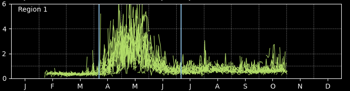

# Using the Pipeline 

# Step 1: masking/create_masks.ipynb
[masking/create_masks.ipynb](https://github.com/tparker1/chlora_plots/blob/c0e34ab347d5392280ceb00c8096bde6909150a6/masking/create_masks.ipynb) 

### Initialize
Initialize the masking process with an encompassing bounding box (of min/max lon/lat **indices**). 
_Give **indices** for a box that is at least larger than all of the polygons you are interested in._

Example: for the _Arrigo et al 2017 Sample Areas.shp_ regions, I use initial bounds:

>minx_index, maxx_index, miny_index, maxy_index = "11800", "13029", "2894", "2325"

``visual check`` Plots the current bounding box on a map of Greenland.

_Note: make bounding box tight so that step 2 runs smoothly_

### load polygons
``SET polygon_folder``  (path containing polygon_file)

``SET polygon_file``    (a single shp file with one to many polygons, such as _Arrigo et al 2017 Sample Areas.shp_)

``SET group`` name **_note: if you subset the polygons, you must set group name again_**

``SET buffer_distance`` to expand the polygons

#### Subset polygons
Not necessary, but useful if you do not want to run all polygons at once. 
``SET regions`` - a list of Region IDs. 

###  Visualize polygons before masking
Visually presents the bounding box and polygons to be masked. 

### Create Masks
``SET path_to_pkls_folder`` to a folder where you wish to store your regional masks (one .pkl for each polygon region). Ensure _group_ is set.

Example of the masks folder structure:

   
The big idea:

The given polygons (ex: _Arrigo et al 2017 Sample Areas.shp_) are mapped to the Ocean Colour lat/lon grid and saved (via a pkl file) as an numpy masked array. This runs multiple regions in parallel. 

### Plot
Visually confirm that the stored masks are as expected.

# Step 2: download/retrieve_opendap_gl_*.ipynb
_Note_ There are 2 types of files: _data_ and _means_

[_retrieve_opendap_gl__**_data_**_.ipynb_](https://github.com/tparker1/chlora_plots/blob/63bfd92d86f2549ce19a49713800a212d32c840c/download/retrieve_opendap_gl_chla_data.ipynb)         |  [_retrieve_opendap_gl__**_means_**_.ipynb_](https://github.com/tparker1/chlora_plots/blob/63bfd92d86f2549ce19a49713800a212d32c840c/download/retrieve_opendap_gl_chla_means.ipynb) 
:-------------------------:|:-------------------------:
.netcdf | .csv
retrieves batches of netcdf files for the entire bounding box that encompasses the polygons (masks) in batches (default = 50 days). | computes and stores the daily average chlor_a value over each region (polygon/mask) and write the output to a .csv in batches (default = 500 days). 
 |  

## How to use them
### Load Regional Masks
``SET path_to_pkls_folder`` In step 1 you created and stored numpy masks for each region as a .pkl file. Now we will load them back into memory. CHANGE path_to_pkls_folder such that it points to the folder containing your pkl files. 

_Note: It is expected that there is only one group in this folder, and thus, there should only be 1 bounding box file._

### Define output folders
[_retrieve_opendap_gl__**_data_**_.ipynb_](https://github.com/tparker1/chlora_plots/blob/63bfd92d86f2549ce19a49713800a212d32c840c/download/retrieve_opendap_gl_chla_data.ipynb)         |  [_retrieve_opendap_gl__**_means_**_.ipynb_](https://github.com/tparker1/chlora_plots/blob/63bfd92d86f2549ce19a49713800a212d32c840c/download/retrieve_opendap_gl_chla_means.ipynb) 
:-------------------------:|:-------------------------:
``SET destination_path``: Where you would like to store the batched data. Files may be large. | ``SET destination_path``: : Where you would like to store the daily average .csv files
``SET temp_path``: A temporary staging space for files being created. |

Run the cell to obtain the data in batches. 
If the code encounters more than 5 errors, you will need to manually restart by running the cell again. 

# Step 3: plotting
readme WIP. 

